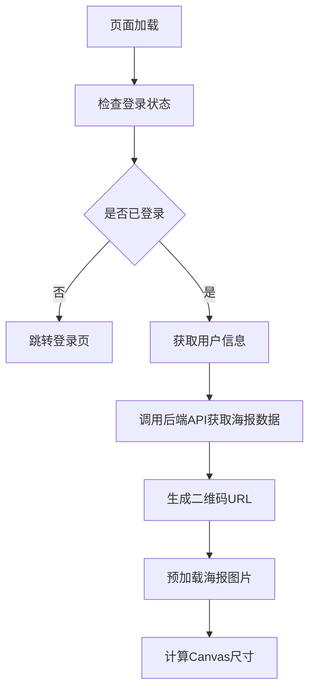
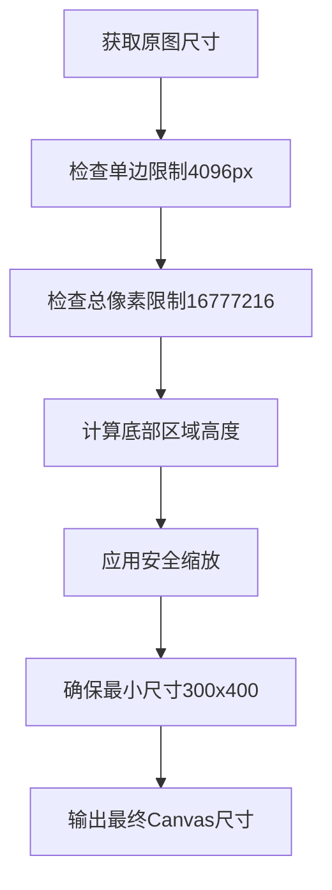
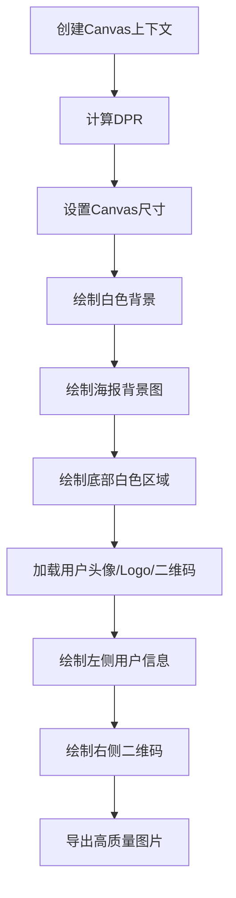

# 微信小程序海报生成分享页面

## 项目概述

这是一个微信小程序的海报生成和分享功能模块，主要用于教育平台的推荐邀请功能。用户可以生成个性化的推荐海报，并分享给微信好友或朋友圈，实现老生推荐新生的营销功能。

## 功能特性

### 🎨 海报生成
- **动态海报合成**：基于Canvas 2D API实现高质量海报生成
- **自适应尺寸**：根据设备屏幕和后端图片自动调整Canvas尺寸
- **智能缩放**：防止Canvas尺寸超限，支持降级处理
- **高质量输出**：支持最高质量(1.0)的图片导出

### 📱 用户体验
- **实时预览**：海报生成后即时显示预览
- **长按保存**：支持长按海报保存到相册
- **权限管理**：智能处理相册保存权限
- **加载状态**：优雅的加载动画和状态提示

### 🔗 分享功能
- **微信好友分享**：通过小程序原生分享API
- **朋友圈分享**：保存海报后手动发布到朋友圈
- **个性化内容**：包含用户头像、昵称和专属二维码

### 🛡️ 稳定性保障
- **防重复调用**：多重标记防止重复生成
- **错误处理**：完善的异常捕获和降级方案
- **文件验证**：生成后验证图片文件完整性

## 技术架构

### 核心技术栈
- **微信小程序原生框架**
- **Canvas 2D API**：高性能图像绘制
- **Vant Weapp**：UI组件库
- **Promise/Async-Await**：异步处理

### 关键模块

#### 1. 登录管理 (`LoginManager`)
```javascript
// 检查用户登录状态
const isLoggedIn = LoginManager.isLoggedIn();
```

#### 2. 学生信息管理 (`StudentManager`)
```javascript
// 获取当前学生信息
const currentStudent = StudentManager.getUserInfo();
```

#### 3. 邀请API (`inviteApi`)
```javascript
// 获取分享海报数据
const res = await inviteApi.getSharePosterData(activityId, employeeId);
```

## 海报生成流程

### 1. 初始化阶段


### 2. Canvas尺寸计算


### 3. 海报绘制流程


## 核心代码解析

### Canvas尺寸优化算法
```javascript
calculateCanvasSize(imageWidth, imageHeight) {
  const MAX_CANVAS_SIZE = 4096;
  const MAX_TOTAL_PIXELS = 16777216;
  
  // 1. 单边尺寸限制
  let scaleRatio = 1;
  if (imageWidth > MAX_CANVAS_SIZE || imageHeight > MAX_CANVAS_SIZE) {
    const widthRatio = MAX_CANVAS_SIZE / imageWidth;
    const heightRatio = MAX_CANVAS_SIZE / imageHeight;
    scaleRatio = Math.min(widthRatio, heightRatio);
  }
  
  // 2. 总像素限制
  const totalPixels = finalWidth * totalHeight;
  if (totalPixels > MAX_TOTAL_PIXELS) {
    const pixelRatio = Math.sqrt(MAX_TOTAL_PIXELS / totalPixels);
    finalWidth = Math.floor(finalWidth * pixelRatio);
    finalHeight = Math.floor(finalHeight * pixelRatio);
  }
}
```

### 智能DPR计算
```javascript
// 根据Canvas尺寸动态调整DPR，避免内存溢出
let dpr = systemDpr;
const maxPixelsWithDpr = canvasWidth * canvasHeight * dpr * dpr;
const MAX_SAFE_PIXELS = 12000000;

if (maxPixelsWithDpr > MAX_SAFE_PIXELS) {
  dpr = Math.sqrt(MAX_SAFE_PIXELS / (canvasWidth * canvasHeight));
  dpr = Math.max(1, Math.min(dpr, 3)); // DPR范围：1-3
}
```

### 二维码生成策略
```javascript
generateQrcodeImage(shareId) {
  const envVersion = wx.getAccountInfoSync().miniProgram.envVersion;
  const localHost = envVersion === 'release' 
    ? 'https://parents-mp.entstudy.com'
    : 'https://parents-mp-rls.entstudy.com';
    
  return `${localHost}/mp/parents/qr-code/getUnlimitedQRCode?scene=shareId=${shareId}&page=pages/new-student-landing/index&width=430&envVersion=${envVersion}`;
}
```

## 页面参数配置

### 输入参数
| 参数名 | 类型 | 必填 | 说明 |
|--------|------|------|------|
| `activityId` | String | 是 | 活动ID |
| `studentId` | String | 是 | 学生ID |
| `employeeId` | String | 否 | 员工ID |
| `themeColor` | String | 否 | 主题色，默认#FF4E4E |

### 使用示例
```javascript
// 页面跳转
wx.navigateTo({
  url: `/pages/share-friend/index?activityId=123&studentId=456&employeeId=789&themeColor=%23FF4E4E`
});
```

## 海报布局设计

### 整体结构
```
┌─────────────────────────────┐
│                             │
│        海报背景图片           │
│     (动态尺寸，保持比例)       │
│                             │
├─────────────────────────────┤
│  👤 用户名        📱 二维码  │
│     邀你一起 [Logo]          │
│                             │
└─────────────────────────────┘
```

### 尺寸规范
- **基准宽度**：750px（iPhone 6设计稿标准）
- **底部区域高度**：160px（基础值，按比例缩放）
- **内边距**：24px
- **元素间距**：20px
- **头像尺寸**：100px（圆形）
- **二维码尺寸**：135px（150px * 0.9缩放）
- **字体大小**：30px

## 错误处理机制

### 1. Canvas尺寸错误
```javascript
handleCanvasSizeError() {
  // 使用更保守的尺寸重新计算
  const MAX_SAFE_WIDTH = 1200;
  const MAX_SAFE_HEIGHT = 1600;
  // 重新生成海报
}
```

### 2. 图片加载失败
```javascript
posterImg.onerror = () => {
  // 使用渐变背景作为兜底方案
  const gradient = ctx.createLinearGradient(0, 0, 0, posterHeight);
  gradient.addColorStop(0, '#FFF6EF');
  gradient.addColorStop(1, '#FAFAFA');
};
```

### 3. 权限处理
```javascript
// 相册保存权限被拒绝时的处理
if (res.authSetting['scope.writePhotosAlbum'] === false) {
  wx.showModal({
    title: '提示',
    content: '需要您授权保存相册权限',
    success: () => wx.openSetting()
  });
}
```

## 性能优化

### 1. 防重复调用
- `isInitialized`：防止重复初始化
- `isLoadingQRCode`：防止重复生成二维码
- `isLoadingPosterData`：防止重复加载海报数据
- `isGenerating`：防止重复生成海报

### 2. 内存管理
- 智能DPR计算，避免Canvas过大导致内存溢出
- 图片加载完成后及时释放引用
- 使用Promise.all并行加载图片资源

### 3. 用户体验
- 异步加载，避免阻塞UI
- 优雅的加载动画
- 错误状态的友好提示

## 兼容性说明

### 微信版本要求
- **最低版本**：微信7.0.0+
- **Canvas 2D**：基础库2.9.0+
- **备用方案**：旧版Canvas API兼容

### 设备适配
- **iOS**：完全支持
- **Android**：完全支持  
- **开发者工具**：完全支持

## 部署配置

### 环境变量
```javascript
const envVersion = wx.getAccountInfoSync().miniProgram.envVersion;
const apiHost = envVersion === 'release' 
  ? 'https://parents-mp.entstudy.com'     // 生产环境
  : 'https://parents-mp-rls.entstudy.com'; // 测试环境
```

### 小程序配置
```json
{
  "appId": "wx2c1425e1867a4c8d",
  "pages": [
    "pages/share-friend/index"
  ]
}
```

## 测试用例

### 基础功能测试
1. **正常流程**：登录用户 → 传入参数 → 生成海报 → 保存分享
2. **未登录用户**：跳转登录页面
3. **网络异常**：使用默认图片兜底
4. **权限拒绝**：引导用户开启权限

### 边界条件测试
1. **超大图片**：自动缩放到安全尺寸
2. **异常尺寸**：使用默认比例750x1334
3. **图片加载失败**：渐变背景兜底
4. **Canvas内存不足**：降级处理

## 维护说明

### 常见问题
1. **海报生成失败**：检查Canvas尺寸是否超限
2. **图片模糊**：调整DPR和质量参数
3. **保存失败**：检查权限和文件路径
4. **二维码无效**：验证shareId和环境配置

### 更新日志
- **v1.0.0**：基础海报生成功能
- **v1.1.0**：新增Canvas尺寸优化
- **v1.2.0**：完善错误处理机制
- **v1.3.0**：优化性能和用户体验

## 效果展示

### 海报样式1 - 好朋友春面礼

- 卡通风格设计
- 活泼的色彩搭配
- 突出推荐转介绍主题
- 底部包含用户信息和二维码

### 海报样式2 - 清新学习风
  
- 清新自然的插画风格
- 温馨的学习场景
- 适合教育类产品推广
- 统一的品牌元素设计

---

## 联系方式

