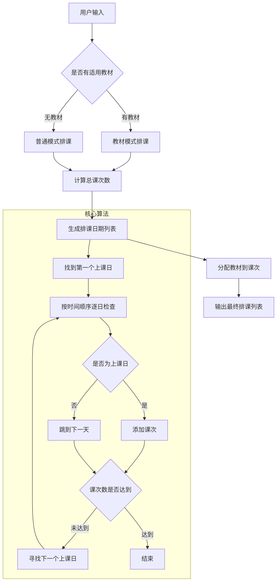

# 一对多周期排课算法详解

## 概述
本文档详细说明一对多班级的周期排课算法实现，包括课次数计算、日期生成和教材分配等核心逻辑。

## 算法架构



## 核心数据结构

### 输入参数
```javascript
// 表单数据
form: {
  materials: [],           // 选择的教材ID数组
  scheduleHours: 13,       // 总排课小时数
  startDate: '2024-09-07', // 开始日期
  scheduleList: [          // 上课周期配置
    {
      weekdays: ['sunday', 'wednesday'], // 上课星期几
      timeRange: ['08:00', '09:00']      // 上课时间段
    }
  ]
}

// 教材列表
joyEnglishTextbookList: [
  {
    id: 1,
    textbookName: 'TJ5',
    expectTime: 12,  // 预期授课小时数
    sort: 1          // 排序
  },
  {
    id: 2, 
    textbookName: 'TJ7',
    expectTime: 1,
    sort: 2
  }
]
```

### 内部数据结构
```javascript
// 时间段配置
timeSlots: [
  {
    weekday: 7,        // 周日=7, 周一=1, ...
    startTime: '08:00',
    endTime: '09:00'
  },
  {
    weekday: 3,        // 周三=3
    startTime: '08:00', 
    endTime: '09:00'
  }
]

// 上课星期几数组（去重排序）
weekDays: [3, 7]  // [周三, 周日]
```

## 算法流程详解

### 第一阶段：课次数计算

#### 1.1 有教材模式
```javascript
// 计算每周上课总时长
const weeklyMinutes = calculateWeeklyMinutes()  // 120分钟
const weeklyHours = weeklyMinutes / 60          // 2小时

// 计算每周课次数
const weeklyClassCount = getWeeklyClassCount()  // 2次课/周

// 计算每课次平均时长
const avgHoursPerClass = weeklyHours / weeklyClassCount  // 1小时/课次

// 根据用户输入计算总课次数
const totalClasses = Math.ceil(scheduleHours / avgHoursPerClass)  // 13课次
```

**计算示例：**
- 用户输入：13小时
- 周期：周日8-9点，周三8-9点
- 每周时长：2小时
- 每周课次：2次
- 平均每课时长：1小时
- **总课次数：13课次**

#### 1.2 教材分配逻辑
```javascript
// 按教材顺序分配课次
selectedTextbooks.forEach((textbook, index) => {
  if (index === selectedTextbooks.length - 1) {
    // 最后一本教材：分配所有剩余课次
    classesForTextbook = remainingClasses
  } else {
    // 非最后教材：按预期时长分配
    const expectedClasses = Math.ceil(textbookHours / avgHoursPerClass)
    classesForTextbook = Math.min(expectedClasses, remainingClasses)
  }
})
```

**教材分配示例：**
- TJ5教材：预期12小时 → 分配12课次
- TJ7教材：剩余课次 → 分配1课次

### 第二阶段：日期生成算法

这是算法的核心部分，采用**时间顺序遍历**而非星期几排序。

#### 2.1 初始化
```javascript
// 周日特殊处理：dayjs的周日是0，我们统一为7
const initialWeekDay = currentDate.day() === 0 ? 7 : currentDate.day()

// 上课星期几数组（已排序）
const weekDays = [3, 7]  // [周三, 周日]
```

#### 2.2 寻找第一个上课日
```javascript
if (!weekDays.includes(initialWeekDay)) {
  // 情况1：找本周后续的上课日
  for (const day of weekDays) {
    if (day > initialWeekDay) {
      currentDate = currentDate.add(day - initialWeekDay, 'day')
      found = true
      break
    }
  }
  
  // 情况2：本周无后续上课日，跳到下周第一个上课日
  if (!found) {
    const firstDayNextWeek = weekDays[0]  // 3（周三）
    const daysToAdd = 7 - initialWeekDay + firstDayNextWeek
    currentDate = currentDate.add(daysToAdd, 'day')
  }
}
```

#### 2.3 核心循环：逐日生成课次
```javascript
while (count < totalClasses) {
  const currentWeekDay = currentDate.day() === 0 ? 7 : currentDate.day()
  
  // 检查今天是否为上课日
  if (weekDays.includes(currentWeekDay)) {
    // 找到匹配的时间段（同一天可能有多个时间段）
    const matchingSlots = timeSlots.filter(slot => slot.weekday === currentWeekDay)
    
    matchingSlots.forEach(slot => {
      if (count < totalClasses) {
        scheduleList.push({
          courseDate: currentDate.format('YYYY-MM-DD'),
          startTime: slot.startTime,
          endTime: slot.endTime,
          // ... 其他字段
        })
        count++
      }
    })
  }
  
  // 寻找下一个上课日
  currentDate = findNextClassDate(currentDate, weekDays)
}
```

#### 2.4 下一个上课日查找算法
```javascript
function findNextClassDate(currentDate, weekDays) {
  const currentWeekDay = currentDate.day() === 0 ? 7 : currentDate.day()
  
  // 特殊处理：周日跳转逻辑
  if (currentWeekDay === 7) {
    const firstDayNextWeek = weekDays[0]
    const daysToAdd = firstDayNextWeek === 7 ? 7 : firstDayNextWeek
    return currentDate.add(daysToAdd, 'day')
  }
  
  // 普通情况：找本周后续上课日
  for (const day of weekDays) {
    if (day > currentWeekDay) {
      return currentDate.add(day - currentWeekDay, 'day')
    }
  }
  
  // 本周无后续上课日，跳到下周第一个上课日
  const firstDayNextWeek = weekDays[0]
  const daysToWeekEnd = 7 - currentWeekDay
  const daysFromWeekStart = firstDayNextWeek === 7 ? 0 : firstDayNextWeek
  return currentDate.add(daysToWeekEnd + daysFromWeekStart, 'day')
}
```

### 第三阶段：教材分配到课次

```javascript
function assignTextbooksToScheduleByClasses(scheduleList, textbookClassInfo) {
  let currentClassIndex = 0
  
  // 按教材顺序分配
  textbookClassInfo.forEach(info => {
    const { textbook, classes } = info
    
    // 为当前教材分配指定数量的课次
    for (let i = 0; i < classes && currentClassIndex < scheduleList.length; i++) {
      scheduleList[currentClassIndex].textbookId = textbook.id
      scheduleList[currentClassIndex].textbookName = textbook.textbookName
      currentClassIndex++
    }
  })
  
  // 剩余课次使用最后一本教材
  const lastTextbook = textbookClassInfo[textbookClassInfo.length - 1]?.textbook
  while (currentClassIndex < scheduleList.length) {
    scheduleList[currentClassIndex].textbookId = lastTextbook.id
    scheduleList[currentClassIndex].textbookName = lastTextbook.textbookName
    currentClassIndex++
  }
}
```

## 实际运行示例

### 输入参数
- 开始日期：2024-09-07（周六）
- 上课周期：周日8-9点，周三10-11点  
- 总课时：13小时
- 教材：TJ5(12h) + TJ7(1h)

### 执行过程

#### 步骤1：计算课次数
- 每周2次课，每次1小时
- 总课次：13次

#### 步骤2：寻找第一个上课日
- 开始日期：9月7日（周六）
- 上课星期：[3(周三), 7(周日)]
- 周六不是上课日，找下一个上课日
- 9月8日（周日）是第一个上课日

#### 步骤3：生成课次列表
```
第1次：2024-09-08 周日 08:00-09:00 (TJ5)
第2次：2024-09-11 周三 10:00-11:00 (TJ5) 
第3次：2024-09-15 周日 08:00-09:00 (TJ5)
第4次：2024-09-18 周三 10:00-11:00 (TJ5)
...
第12次：2024-10-16 周三 10:00-11:00 (TJ5)
第13次：2024-10-20 周日 08:00-09:00 (TJ7) ✅
```

## 关键特性

### 1. 周日特殊处理
- 统一将周日映射为7（而不是JavaScript默认的0）
- 周日跳转时特殊处理，确保正确的时间顺序

### 2. 时间顺序保证
- 不按星期几预排序，而是按实际时间顺序生成
- 解决了"周日、周三"排课最后一次课错误的问题

### 3. 灵活的时间段支持
- 支持同一天多个时间段
- 支持不同星期几的不同时间段

### 4. 教材智能分配
- 按教材顺序和预期时长自动分配
- 最后一本教材承担剩余所有课次

## 算法优势

1. **时间准确性**：严格按照实际日期顺序排课
2. **周日兼容性**：正确处理包含周日的排课周期
3. **灵活性**：支持任意星期几组合和时间段
4. **教材智能化**：自动计算和分配教材课次
5. **边界处理**：正确处理跨周、跨月的日期计算

## 测试用例

### 用例1：周日+周三问题
- 输入：周日8-9点，周三10-11点，13课时
- 预期：最后一次课在周日
- 结果：✅ 正确

### 用例2：连续工作日
- 输入：周一、周三、周五，10课时  
- 预期：按时间顺序排课
- 结果：✅ 正确

### 用例3：周末连续
- 输入：周六、周日，6课时
- 预期：交替排课
- 结果：✅ 正确

这个算法的核心思想是**"按时间顺序逐日检查"**，而不是传统的**"按星期几循环排课"**，从而确保了时间顺序的准确性。
